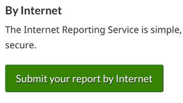

  

    <ul class="toc lst-spcd col-md-12">
      <li class="col-md-4 col-sm-6"><a class="list-group-item" href="about-tss.html">Why measure task success</a></li>
      <li class="col-md-4 col-sm-6"><a class="list-group-item" href="methods.html">Survey methodology</a></li>
      <li class="col-md-4 col-sm-6"><a class="list-group-item active" href="benefits.html">How to use survey results</a></li>
    </ul>
  

There are a number of short, medium, and longer term actions that can be taken to improve workflows, processes, and content using the GC Task Success Survey.

## On this page

* [Improve understanding of issues](#improve-understanding-of-issues)
* [Improve content and navigation](#improve-content-and-navigation)
* [Decide what to improve](#decide-what-to-improve)
* [Case studies](#case-studies)

## Improve understanding of issues

<table class="provisional gc-table table table-striped" id="myTable1">
    <caption class="wb-inv">Common issues</caption>
    <thead>
        <tr>
            <th scope="col">Type</th>
            <th scope="col">Action</th>
        </tr>
    </thead>
    <tbody>
        <tr>
            <td data-label="Type">Improve understanding of top tasks</td>
            <td data-label="What to do">Check what tasks are affecting your departmental score and analyze comments to understand why.</td>
        </tr>
        <tr>
            <td data-label="Type">Collaborate with other data owners</td>
            <td data-label="What to do">Corroborate survey data with other sources such as: web analytics, call reports, social media trends, and previous usability research</td>
        </tr>
        <tr>
            <td data-label="Type">Socialize and raise awareness of survey results</td>
            <td data-label="What to do">Brief senior management, policy, program, and content owners with survey results and insights from comments - leveraging quotes from real users.
              Incorporate survey results and comments into existing reporting activities.</td>
        </tr>
    </tbody>
</table>

## Improve content and navigation

<table class="provisional gc-table table table-striped" id="myTable1">
    <caption class="wb-inv">Common issues</caption>
    <thead>
        <tr>
            <th scope="col">Type</th>
            <th scope="col">Problem</th>
            <th scope="col">Action</th>
        </tr>
    </thead>
    <tbody>
        <tr>
            <td data-label="Type">Technical errors</td>
            <td data-label="Issue">Something is broken</td>
            <td data-label="What to do">Correct small errors like broken links or typos. Diagnose and fix interactive features.</td>
        </tr>
        <tr>
            <td data-label="Type">Navigation and findability</td>
            <td data-label="Issue">I can’t find the answer</td>
            <td data-label="What to do">Reconsider information architecture, improve "information scent" to the page or section of content (for example, improved link labels). Consider improvements to content design such as the hierarchy of information, headings, use of expand/collapse.</td>
        </tr>
        <tr>
            <td data-label="Type">Content</td>
            <td data-label="Issue">Can’t understand or use an answer</td>
            <td data-label="What to do">Rewrite or edit using plain language. Improve content design.  Consider building an answer wizard.</td>
        </tr>
        <tr>
            <td data-label="Type">Content gap / Navigation</td>
            <td data-label="Issue">Answer not on page</td>
            <td data-label="What to do">Include or link to the answer in the content</td>
        </tr>
    </tbody>
</table>

## Decide what to improve

* Decide which tasks to prioritize for improvement ([learn more about choosing what to improve](prioritize.html) )
* Use results and comments to build a case for larger service or content improvements
* Gather baseline measurements prior to content, service or policy changes
* Consider adding the [page feedback tool](https://design.canada.ca/continuous-improvement/monitoring/feedback.html) to better understand pain points on specific pages
* Monitor for changes to results and comments while undertaking improvements

## Case studies

    

        

            

                
            

            <h3><a class='stretched-link' href="case-study-ei.html">Improved content design</a></h3>
            
Using comments to improve the  Submit an EI report task

        

    

