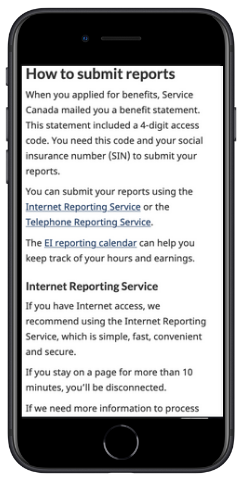
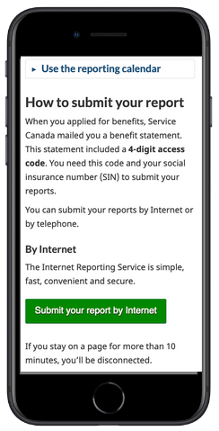

  

    <ul class="toc lst-spcd col-md-12">
      <li class="col-md-4 col-sm-6"><a class="list-group-item" href="about-tss.html">Why measure task success</a></li>
      <li class="col-md-4 col-sm-6"><a class="list-group-item" href="methods.html">Survey methodology</a></li>
      <li class="col-md-4 col-sm-6"><a class="list-group-item" href="benefits.html">How to use survey results</a></li>
    </ul>
  

By reading GC Task Success Survey comments for the Submit and Employment Insurance report task, the team at Employment and Social Development Canada (ESDC) was able to spot an issue that they believed could be improved through minor content design changes.

## Problem to solve: the reporting link was hard to find

<section class="media">
    
    

        
A common complaint was that the <strong>reporting link was hard to find</strong> on the <a href="https://www.canada.ca/en/services/benefits/ei/employment-insurance-reporting.html">Employment Insurance reporting page</a>.

        <blockquote>“Finding the sign-in homepage link is a challenge”</blockquote>
        <ul>
            <li>There was an inline link to begin a report in the middle of a long paragraph.</li>
            <li>The primary call-to-action button was after serveral lengthy paragraphs of text.</li>
        </ul>
    

</section>

## What they did

As a team, they:

* hypothesized issues impacting sign-in findability
  * from previous research, the team knew that inline links are easily missed as users scroll web pages
  * long paragraphs of secondary content were impacting the findability of the call to action button
  * the primary call-to-action button text was weak
* prototyped simple changes using content design (what to include, headings, button colour and call to action)
  * removed inline links
  * collapsed secondary content (like the privacy statement) to make the primary button more visible
  * changed the colour and size of the primary button to increase visibility for this super task
  * changed button text from "Continue to the Internet Reporting Service" to "Submit your report by internet"
  * minor text changes to H2 headings
* A/B tested and measured impact of changes
* implemented changes and monitored comments after the change

## Outcomes

<section class="media">
    
    

        <h4 class="media-heading">For users</h4>
        <ul>
            <li>increased click-through on sign-in button</li>
            <li>decreased time spent on page (~200 user hours saved / week)</li>
        </ul>
        <h4 class="media-heading">For the team</h4>
        <ul>
            <li>acted on survey comments, socialized and leveraged GC Task Success survey comments</li>
            <li>learned to use A/B testing and can now apply the skill to more complex problems</li>
        </ul>
        
<a href="https://www.canada.ca/en/services/benefits/ei/employment-insurance-reporting.html">View the result</a>

    

</section>

## Learn more

* [Blog post on making links more effective](https://blog.canada.ca/2021/07/20/effective-links.html)
* [Links - Canada.ca Content Style Guide](https://www.canada.ca/en/treasury-board-secretariat/services/government-communications/canada-content-style-guide.html#wp7-1)
* [Information foraging: A Theory of How people navigate on the web](https://www.nngroup.com/articles/information-foraging/)
